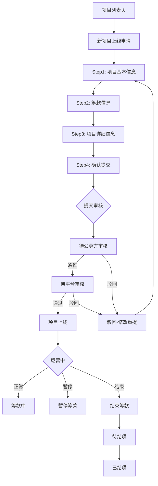
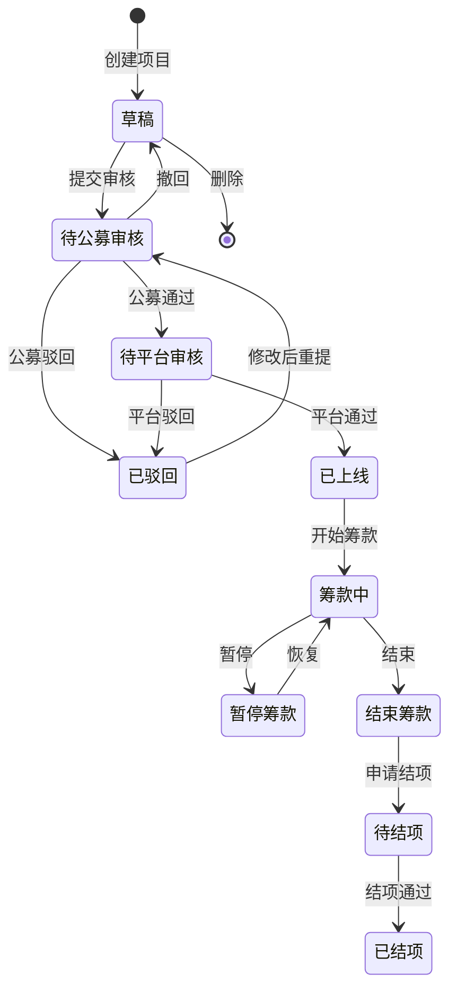
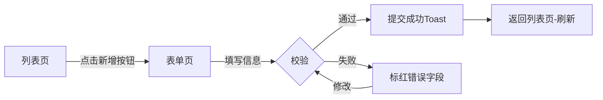
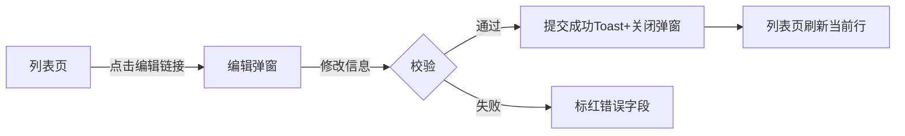
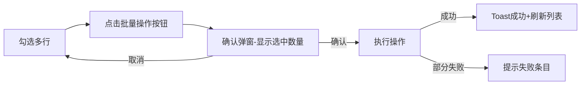
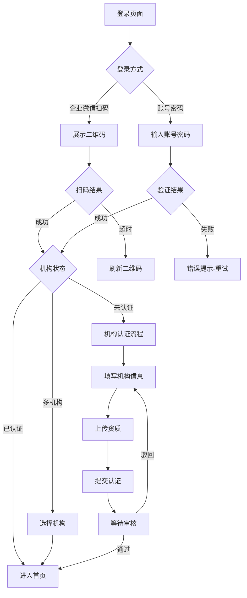
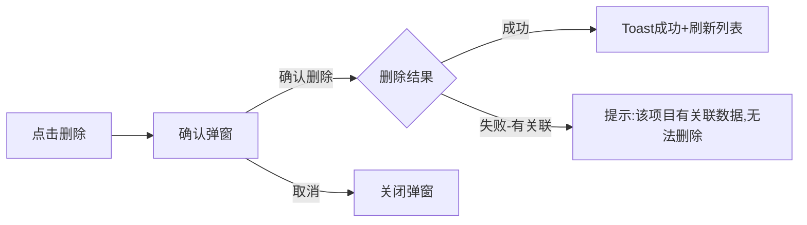
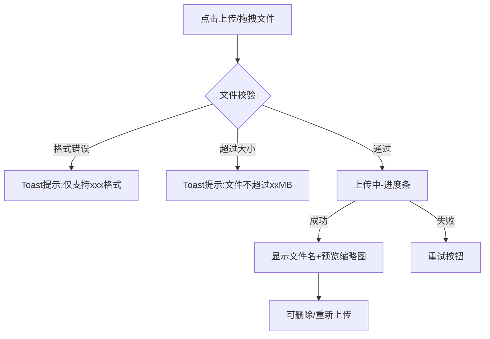
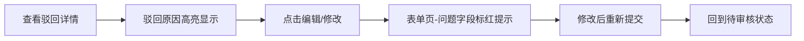

# 腾讯公益机构平台 - 流程规范

> 基于 B 端设计规范 Figma 文件的通用流程提取

---

## 1. 流程设计原则

1. **最短路径** — 核心操作路径不超过 5 步
2. **可回退** — 每一步都支持返回上一步（分步表单）或取消（弹窗）
3. **状态可见** — 用户始终知道当前状态、审核进度、待处理事项
4. **容错设计** — 异常情况有明确提示和恢复方案
5. **数据不丢失** — 表单数据自动暂存，中断后可恢复

---

## 2. 通用流程模板

### 2.1 项目审核流程



**各节点说明**:

| 节点 | 页面类型 | 用户操作 | 关键交互 |
|------|---------|---------|---------|
| 项目列表 | 业务集合页 | 点击"新项目上线申请" | 跳转分步表单 |
| Step1-4 | 分步表单 | 填写信息、上下步 | 自动暂存、步骤指示器 |
| 提交审核 | 确认页 | 确认提交 | 不可撤回提示 |
| 待审核 | 详情页 | 等待/撤回 | 状态圆点+时间线 |
| 驳回 | 详情页 | 查看原因→修改 | 红色驳回原因+编辑入口 |
| 上线 | 详情页 | 运营管理 | 状态切换为绿色 |

---

### 2.2 项目发布流程（状态机）



**状态流转规则**:
- 草稿 → 只能前进(提交)或删除
- 审核中 → 只能等待或撤回(撤回回到草稿)
- 已驳回 → 只能修改重提(回到待审核)
- 已上线 → 进入运营生命周期
- 结项 → 终态，不可逆

---

### 2.3 数据新增/编辑流程

#### A. 列表页新增（跳转表单页）



#### B. 列表页编辑（弹窗快捷编辑）



#### C. 批量操作流程



---

### 2.4 登录/认证流程



**登录页交互细节**:
- 二维码有效期: 60s，到期自动刷新
- 扫码中: 二维码上覆盖"扫码中..."遮罩
- 扫码成功: 自动跳转，无需点击
- 密码错误: 输入框标红 + 错误文字，3次后出现验证码
- 多机构用户: 登录后弹窗选择机构

---

### 2.5 数据删除流程



**删除规则**:
- 所有删除必须二次确认
- 确认弹窗文案: "删除后将不可恢复，确认删除？"
- 有关联数据时禁止删除并提示原因
- 批量删除显示选中数量: "确认删除已选中的 X 条数据？"

---

### 2.6 文件上传流程



**上传规则**:
- 图片: JPG/PNG/GIF, 单张≤5MB
- 文档: PDF/DOC/DOCX, 单个≤20MB
- 上传中显示进度百分比
- 图片上传成功后展示缩略图(112×112px)
- 多文件上传支持逐个删除

---

## 3. 审核流程节点规范

### 3.1 审核角色

| 角色 | 职责 | 审核内容 |
|------|------|---------|
| 发起方(机构) | 提交申请 | 填写完整信息 |
| 公募方 | 一审 | 业务合规性、资质审核 |
| 平台方 | 终审 | 平台规则、内容审核 |

### 3.2 审核操作

| 操作 | 执行者 | 结果 |
|------|--------|------|
| 通过 | 审核方 | 进入下一审核节点或上线 |
| 驳回 | 审核方 | 回到发起方，附驳回原因 |
| 撤回 | 发起方 | 回到草稿状态 |
| 催审 | 发起方 | 发送提醒给审核方 |

### 3.3 驳回后重提



**驳回交互规则**:
- 驳回原因: 红色文字，显示在对应字段上方
- 详情页顶部: 红色警告条展示"已被驳回"
- 可直接跳转到问题字段进行修改
- 修改后重提，之前通过的步骤无需重新审核（按实际业务决定）

---

## 4. 通用流程交互模式

### 4.1 操作确认模式

| 风险等级 | 确认方式 | 示例 |
|---------|---------|------|
| 低风险 | 直接执行 + Toast | 保存草稿、复制链接 |
| 中风险 | 确认弹窗(单按钮) | 提交审核、公开留言 |
| 高风险 | 确认弹窗(需输入) | 删除项目(输入项目名确认) |
| 不可逆 | 二次确认 + 倒计时 | 退出机构(需等3s才可确认) |

### 4.2 异步操作模式

| 场景 | 发起 | 等待 | 完成 |
|------|------|------|------|
| 提交审核 | 按钮 loading | 跳转到"等待审核"状态页 | 通知(站内信/短信) |
| 导出数据 | "导出"按钮 | Toast"导出中,请稍候" | 下载链接 或 消息中心通知 |
| 批量处理 | 确认后执行 | 进度提示(X/总数) | 结果汇总弹窗 |

### 4.3 错误恢复模式

| 错误类型 | 恢复方式 |
|---------|---------|
| 表单校验失败 | 标红字段+滚动定位+错误文字 |
| 网络超时 | Toast错误+"重试"按钮 |
| 权限不足 | 提示"无权限"+联系管理员引导 |
| 数据冲突 | 提示"数据已被修改"+刷新按钮 |
| 服务器错误 | 通用错误页+自动上报 |

---

## 5. 流程状态视觉映射

### 5.1 状态色彩对应

| 流程状态 | 颜色 | 图标 | 标签样式 |
|---------|------|------|---------|
| 草稿 | Gray #C5C5C5 | 编辑图标 | 灰底灰字 |
| 待审核 | Blue #0052D9 | 时钟图标 | 蓝底蓝字 |
| 审核中 | Blue #0052D9 | loading | 蓝底蓝字 |
| 已通过 | Green #00A870 | ✓ 勾选 | 绿底绿字 |
| 已驳回 | Red #ED3142 | × 关闭 | 红底红字 |
| 已上线 | Green #00A870 | 圆点 | 绿色圆点+文字 |
| 已暂停 | Orange #FF9C00 | 暂停图标 | 橙底橙字 |
| 已结束 | Gray #C5C5C5 | — | 灰底灰字 |

### 5.2 时间线展示

审核进度使用垂直时间线：
```
● 2024-08-01 10:00  提交审核          [已完成-绿色]
│
● 2024-08-02 14:30  公募方审核通过     [已完成-绿色]
│
◐ 2024-08-03 09:00  平台审核中        [进行中-蓝色]
│
○ ────────────────  等待上线          [待处理-灰色]
```

| 节点状态 | 图标 | 连接线 |
|---------|------|--------|
| 已完成 | ● 绿色实心圆 | 绿色实线 |
| 进行中 | ◐ 蓝色半圆/loading | 蓝色实线 |
| 待处理 | ○ 灰色空心圆 | 灰色虚线 |
| 异常/驳回 | ● 红色实心圆 | 红色实线 |
